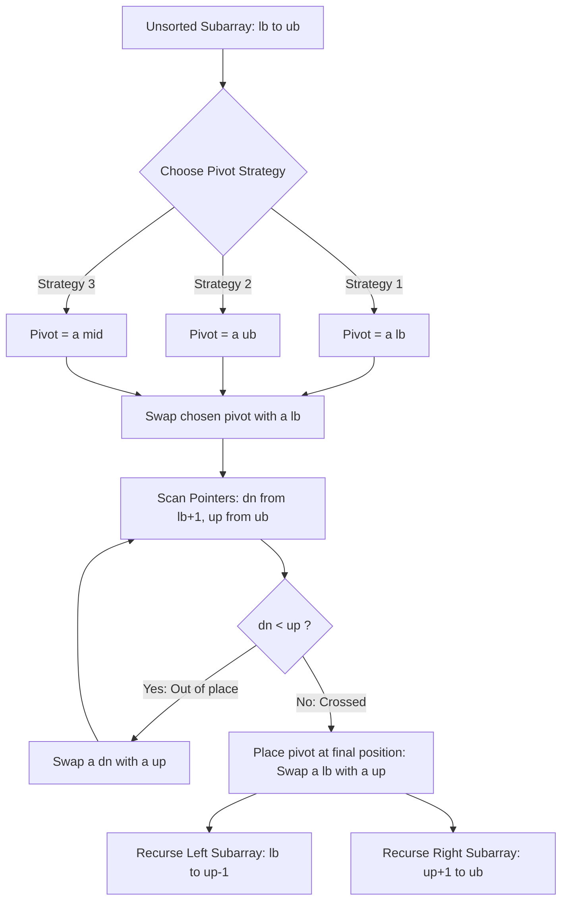
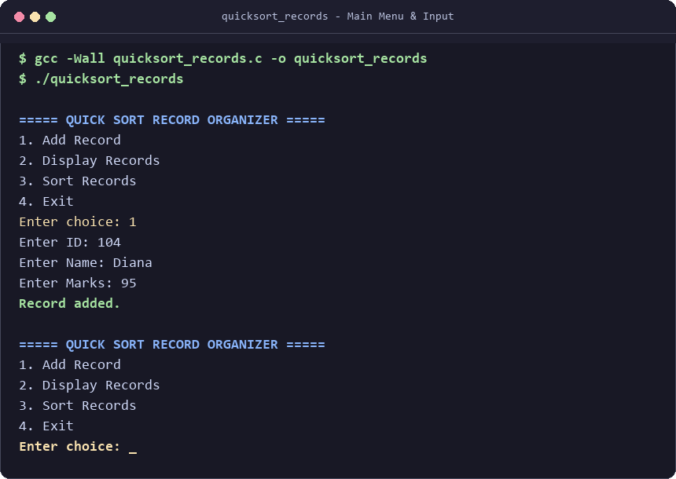
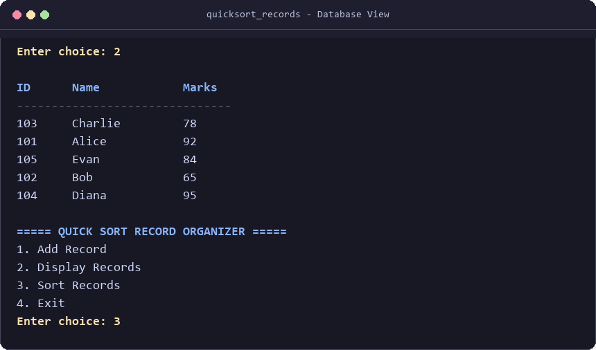
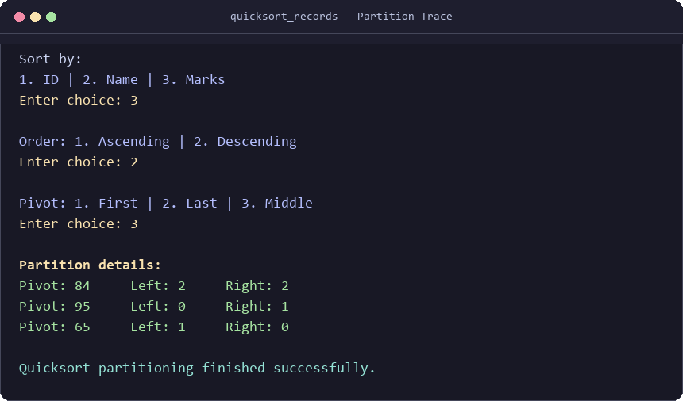
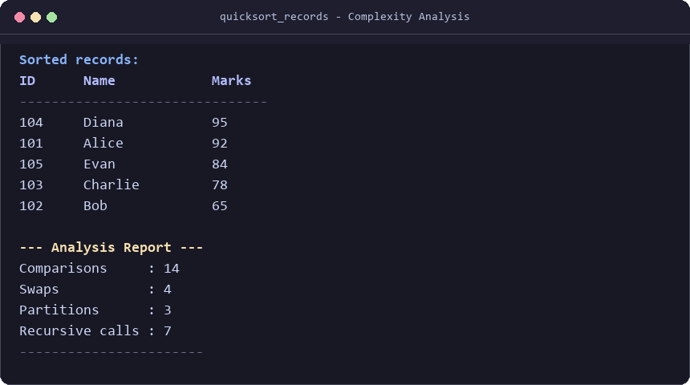

<div align="center">

# ⚡ Quicksort Analyzer (DSA)

### *Interactive Student Record Sorter & Algorithmic Complexity Analyzer in C*

[](https://en.cppreference.com/w/c)
[-F34F29?style=for-the-badge&logo=git&logoColor=white)](https://github.com/DevInfinix/quicksort-analyzer-dsa)
[](https://github.com/DevInfinix/quicksort-analyzer-dsa/stargazers)
[](https://github.com/DevInfinix/quicksort-analyzer-dsa/network/members)
[](https://github.com/DevInfinix/quicksort-analyzer-dsa/issues)
[](LICENSE)

<br/>

<p align="center">
  <b>A lightweight, transparent C application designed to demonstrate the internal mechanics of the Quicksort algorithm on composite data structures, tracking real-world comparisons, swaps, partition steps, and recursive call depth.</b>
</p>

[Key Features](#-key-features) •
[Algorithm Overview](#-algorithm-flow--partitioning) •
[Interactive Demo](#-interactive-demo) •
[Compilation & Run](#-quick-start) •
[Performance Analysis](#-performance-analysis--metrics) •
[Contributors](#-contributors)

</div>

---

## 📌 Project Overview

In collegiate **Data Structures and Analysis of Algorithms (AOA / DSA)** curricula, Quicksort is often taught conceptually on flat integer arrays. 

This project bridges theoretical divide-and-conquer mechanics and practical software engineering by:
1. **Operating on Structured Records:** Managing student profiles (`ID`, `Name`, `Marks`) with full multi-attribute sorting support.
2. **Dynamic Pivot Selection:** Allowing users to switch pivot selection strategies (`First`, `Last`, `Middle/Subarray Center`) to analyze how pivot choices directly influence recursive partitioning balance.
3. **Transparent Execution Tracking:** Recording exact operation counts (`comparisons`, `swaps`, `partitions`, `recursive call stack counts`) at runtime without external profilers or heavy dependencies.
4. **Idempotent Sorting via Backup Arrays:** Preserving raw input arrays so users can repeatedly re-sort the identical dataset across different keys and pivot configurations.

---

## ✨ Key Features

- 🗂️ **Record Management:** Add and review up to 100 structured student records (`id`, `name[30]`, `marks`).
- 🔄 **Multi-Field Sorting:** Sort seamlessly by **Student ID**, **Student Name** (lexicographical `strcmp`), or **Marks**.
- ↕️ **Bi-Directional Order:** Choose between **Ascending** and **Descending** order with zero algorithmic overhead.
- 🎯 **Pivot Strategy Selector:**
  - `First Element` ($P = \text{lb}$)
  - `Last Element` ($P = \text{ub}$)
  - `Middle Element` ($P = \lfloor(\text{lb} + \text{ub})/2\rfloor$)
- 🔍 **Real-Time Step Trace:** Live display of chosen pivot values alongside left and right partition subarray sizes at each stage.
- 📊 **Analytical Instrumentation:** Quantitative tally of comparisons, swaps, partitions, and function calls generated per sort run.

---

## 🔬 Algorithm Flow & Partitioning

Quicksort utilizes a divide-and-conquer paradigm. The core partitioning process rearranges elements around the selected pivot:



### Complexity Reference

| Scenario | Time Complexity | Space Complexity (Stack) | Condition |
| :--- | :---: | :---: | :--- |
| **Best Case** | $\mathcal{O}(n \log n)$ | $\mathcal{O}(\log n)$ | Pivot partitions array into equal halves |
| **Average Case** | $\mathcal{O}(n \log n)$ | $\mathcal{O}(\log n)$ | Random element distribution |
| **Worst Case** | $\mathcal{O}(n^2)$ | $\mathcal{O}(n)$ | Extremely unbalanced partitions (e.g. sorted input with First/Last pivot) |

---

## 📸 Interactive Demo

Here is a visual walk-through of the interactive CLI tool in action:

| 1. Main Menu & Record Creation | 2. Database Formatted Table View |
| :---: | :---: |
|  |  |
| *Intuitive numeric menu with input prompts for ID, Name, and Marks.* | *Clean ASCII tabular layout showing current student records.* |
| **3. Sort Parameters & Partition Trace** | **4. Final Output & Analysis Report** |
|  |  |
| *Real-time partition logging showing pivot value and left/right sizes.* | *Sorted output paired with comprehensive algorithmic complexity metrics.* |

---

## 🚀 Quick Start

### Prerequisites
A standard C compiler (e.g. `gcc`, `clang`, or MSVC MinGW) supporting C99 or later.

### Compilation
Clone the repository and compile with standard warnings enabled:

```bash
git clone https://github.com/DevInfinix/quicksort-analyzer-dsa.git
cd quicksort-analyzer-dsa
gcc -Wall -Wextra quicksort_records.c -o quicksort_records
```

### Execution
Run the executable directly in your terminal:

**Linux / macOS:**
```bash
./quicksort_records
```

**Windows (PowerShell / Command Prompt):**
```powershell
.\quicksort_records.exe
```

---

## 📈 Performance Analysis & Metrics

Each sorting run outputs an empirical analysis report:

```
--- Analysis Report ---
Comparisons     : 14
Swaps           : 4
Partitions      : 3
Recursive calls : 7
-----------------------
```

- **Comparisons:** Incremented every time two records are compared via the centralized comparator `compare()`.
- **Swaps:** Counts physical record struct exchanges in memory during partitioning.
- **Partitions:** Reflects the number of completed sub-array divisions.
- **Recursive Calls:** Directly measures the total call stack activations generated by `quicksort()`.

---

## 📁 Repository Structure

```
quicksort-analyzer-dsa/
├── assets/
│   └── screenshots/
│       ├── 01_main_menu.png
│       ├── 02_display_records.png
│       ├── 03_sorting_partition.png
│       └── 04_analysis_report.png
├── .gitignore
├── README.md
└── quicksort_records.c
```

---

## 👥 Contributors

This project was built and analyzed as part of the **Analysis of Algorithms** academic coursework.

<div align="center">
<table>
  <tr>
    <td align="center" width="25%">
      <a href="https://github.com/DevInfinix">
        <br />
        <sub><b>DevInfinix</b></sub>
      </a><br />
      <sub>Lead Developer</sub>
    </td>
    <td align="center" width="25%">
      <a href="https://github.com/cmrittikaoli-ux">
        <br />
        <sub><b>cmrittikaoli-ux</b></sub>
      </a><br />
      <sub>Contributor</sub>
    </td>
    <td align="center" width="25%">
      <a href="https://github.com/kilmngrrr">
        <br />
        <sub><b>kilmngrrr</b></sub>
      </a><br />
      <sub>Contributor</sub>
    </td>
    <td align="center" width="25%">
      <a href="https://github.com/ayurdapatil">
        <br />
        <sub><b>ayurdapatil</b></sub>
      </a><br />
      <sub>Contributor</sub>
    </td>
  </tr>
</table>
</div>

---

## 📜 License

This project is open-source and distributed under the [MIT License](LICENSE).
Feel free to use and reference it for educational and academic coursework purposes.
